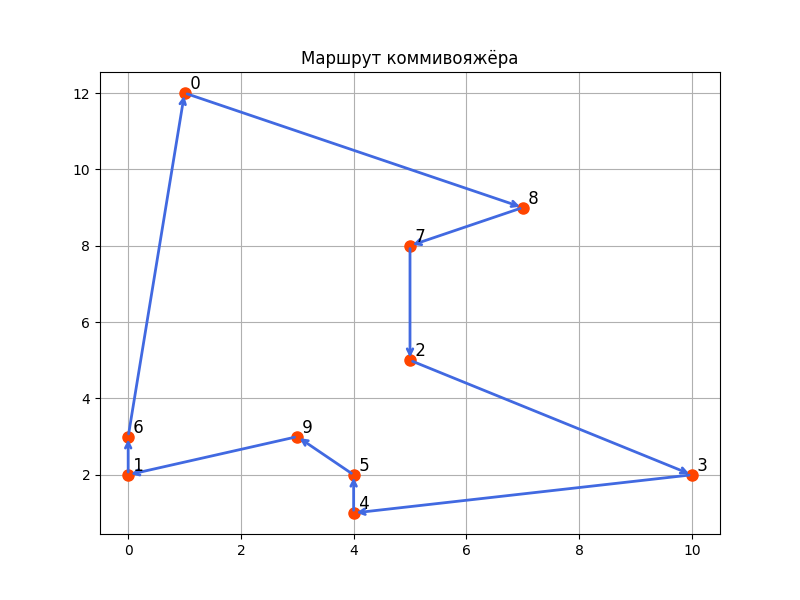

# ЛР #2: [ALGO]: Travelling salesman problem

Студент: Воропаев И. С.

Группа: Z4200

Преподаватель: Маслов И. Д.

Год: 2025

## Цель

Познакомиться с основами структур данных и методикам динамического программирования.

## Задание 1

Поиск оптимального (кратчайшего, быстрейшего или самого дешевого) пути, проходящего через промежуточный пункты по одному разу и возвращающегося в исходную точку. К примеру, нахождение наиболее выгодного маршрута, позволяющего коммивояжеру посетить со своим товаром определенные города по одному разу и вернуться обратно. Мерой выгодности маршрута может быть минимальная длина пути.

### Решение

1. В файле [`lab7/src/input.txt`](../src/input.txt) задается количество городов $n$ и координаты каждого города.

2. По данным из файла сторится таблица (двумерный массив) расстояний $D$, в которой $D[i][j]$ - расстояние от $i$-го города до $j$-го города (симметричная).

3. Мотод поиска кратчайшего пути обхода всех городов заключается в построении таблицы мемоизации $S[k][j]$, где $k=0, 1, ... , 2^n - 1$ - битовая маска посещенных городов и $j=0, 1, ..., n-1$ - номер текущего посещенного города. В ячейку $S[k][j]$ складывается расстояние, которое проходит комммивояжер, попадая в город $j$, посетивший до этого все города из битовой маски $k$.

|$S$      |битовая маска| 0 | 1 | ... | n-1   |
|:--------|:------------|:--|:--|:----|:------|
| 0       | b'00...000' | X | X | ... | X     |
| 1       | b'00...001' | X | X | ... | X     |
| 2       | b'00...010' | X | X | ... | X     |
| 3       | b'00...011' | X | X | ... | X     |
| ...     | ...         |...|...| ... | ...   |
| $2^n-1$ | b'11...111' | X | X | ... | X     |

4. Таблица заполняется последовательно начиная с битовой маски b'00...001' (считая, что мы находимся в самом первом городе сразу). **NOTE:** Хороший вопрос - как зранить эту таблицу, ведь использование двумерного массива будет иметь оверхэд, тк половина битовых масок имеет 0 в конце, а значит заполняться вообще не будет, поэтому для больших размеров, предпочтительнее будет исполльзовать хэш-таблицу, вероятно.

5. Элемент $S[k][j]$ выбирается так: $S[k][j]=\min_{i}(S[\bar{k}][i] + D[i][j])$, где $\bar{k}$ - битовая места без $1$ на (текущем) месте $j$.

6. Итоговоре решение о минимальном пути принимается по последнему ряду таблицы (битовая маска соответствует случаю, когда все города посещены). Минимальное число, которое написано в этом ряду и будет ответом на задачу.

### Сложность и память

- Сложность: необходимо перебрать все битовые маски (с какими-то просто ничего не делать), для каждой из которых перебрать $n$ вариантов последнего посещенного города, а также для каждого из них перебрать $n$ городов, из которых можно было прийти в текущий город, следовательно $T(n)=2^{n}\cdot n^2$

- Память требуется для хранения таблицы $S$ и матрицы расстояний $D$: $M(n)=O(2^n\cdot n) + O(n^2)=O(2^n\cdot n)$

### Пример маршрута из 10 городов, построенного таким алгоритмом



### Реализация:

Реализованный на C++ алгоритм можно увидеть в файле [`lab7/src/main.cpp`](../src/main.cpp)

```
g++ lab7/src/main.cpp -o lab7/build/main   # компиляция
./lab7/build/main                          # запуск
```

## Итог:

- В рамках данной ЛР был изучен метод динамического программирования на примере задачи TSP. 
