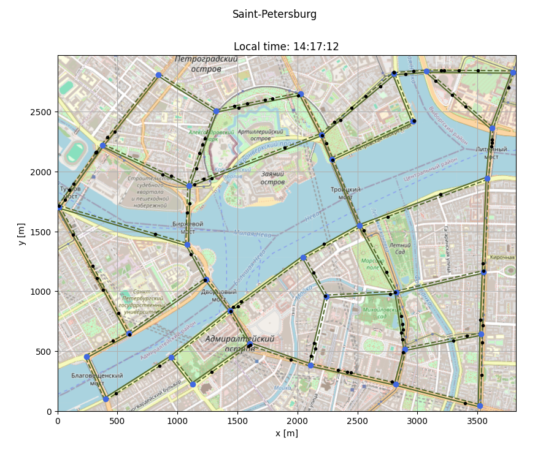
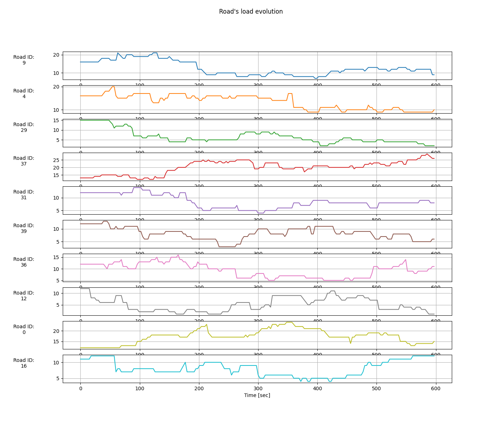
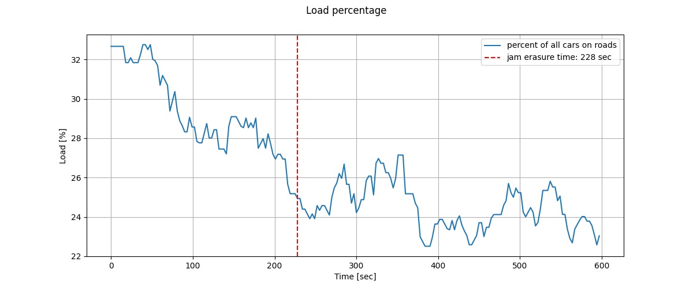
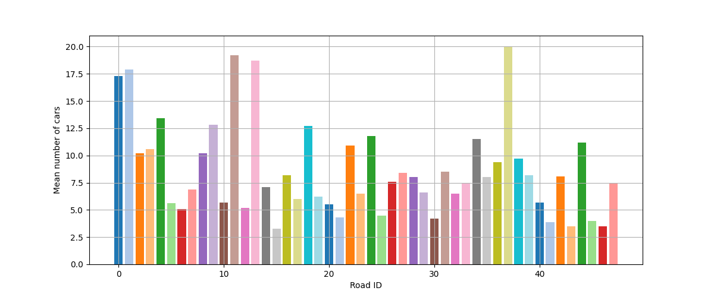

# ЛР #3: [ALGO]: City transport model

Студент: Воропаев И. С.

Группа: Z4200

Преподаватель: Маслов И. Д.

Год: 2025

## Цель

Познакомиться с инструментами, направленными на решение задач, использующих графовые модели.

## Описание модели

- Город (`class City`) характеризуется набором перекрестков и дорог (`class CrossRoad`, `class Road`)
- Каждая дорога начинается в перекрестке и заканчивается в другом перектестке
- Каждая дорога имеет двухстороннее движение
- На перекреске имеется 4 порта `[0, 1, 2, 3]`, к которым подключается дорога (не обязательно ко всем 4), движение управляется светофором
- На каждом $i$-ом перекрестке стоит своя упрощенная модель светофора: $t_i$ секунд он пропускает машины в портах `[0, 2]`, а потом $t_i$ секунд он пропускает машины в портах `[1, 3]`
- Машины (`class Vehicle`) работают по следующему правилу: генерируется случайный маршрут (может даже по одной дороге туда-обратно) и скорость, которая в среднем равна 27.5 км/час. На перекрестке, если светофор красный, то машина стоит.
- По окончании маршрута, машина удаляется из симуляции
- Есть возможность сделать так, чтоб каждые $n$ секунд в городе появлялась новая машина
- 1 единица машины может быть интерпретирована как набор машин (для постобработки)
- Во время симуляции, на каждом шаге временной сетки собирается статистика количества единиц машина на каждом участке дороги для анализа в постобработке

Есть возможность визуализации улиц и машин в городе:

## 1. Определение загруженности участков

В параметры симуляции включены настройки: `sim_duration` - полное время симуляции в секундах и настройка `delta_t` - шаг симуляции в секундах. На каждом шаге в симуляции:
- продвигаются машины (если не стоят на красном светофоре перекрестка)
- меняются состояния светофоров
- появляются новые машины со своими маршрутами (раз в `car_spawn_rate` секунд) / исчезают машины, завершившие заложенный в них маршрут
- записывается сколько машин находится на каждой дороге в данный момент времени

На выход симуляция отдает набор таймстэмпов `time_vec` и состояния дорог `road_state` - количество машин на каждой дороге в каждый момент времени

Далее эти сырые данные обрабатываются в пост-процессоре (`class PostProcessor`). Пост-процессор работает по следующему алгоритму:
1. Находит 10 самых нагруженных дорог в начальный момент времени `time_vec[0]`
2. Строит графики зависимости количества машин на отобранных дорогах с течением времени. Пример:

3. Считает процент машин от общего числа в каждый момент времени на отобранных 10 участках
4. Ищет момент времени, когда загруженность этих участков стала ниже `thrreshold` процентов и резюмирует это в графике вида:

5. Также строит для каждой дороги среднее количество машин на протяжении симуляции:

## 2. Оптимизация загруженности с помощью написанной модели

Оптимизация работы транспортной системы не может предполагать какие-то изменения в поведении автомобилей. Она может предполагать только изменения параметров взаимодействия элементов города между собой. В модели элементов 2 - перекрестки и дороги. Их взаимодействие управляется светофорами, которые параметризуются временем между сменой состояния `зеленый / красный`.

## 3. Вычисление сложности работы симуляции

## Итог
