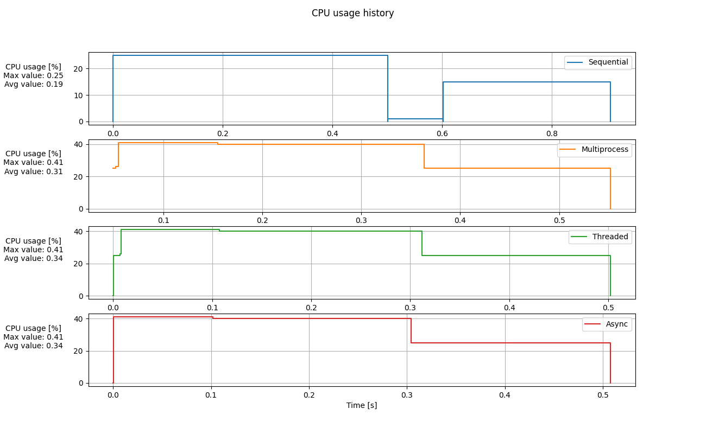
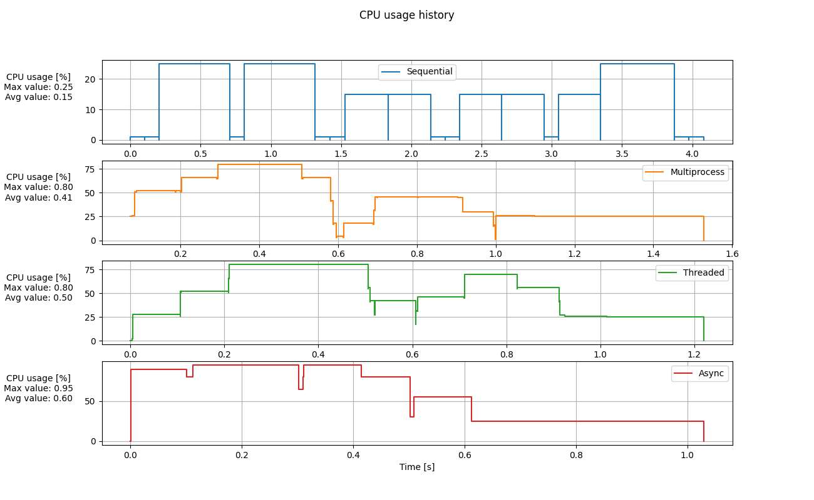
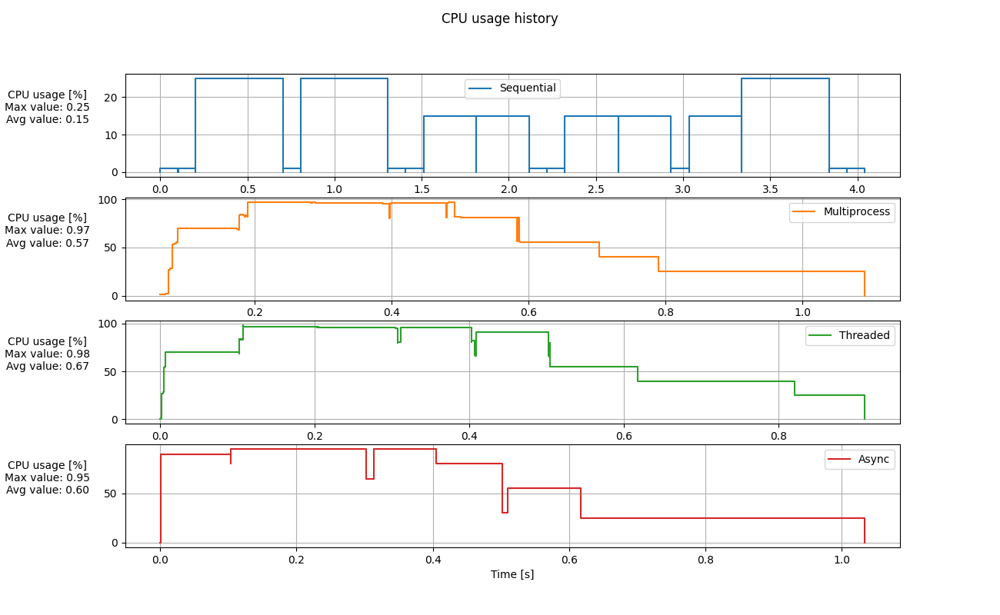
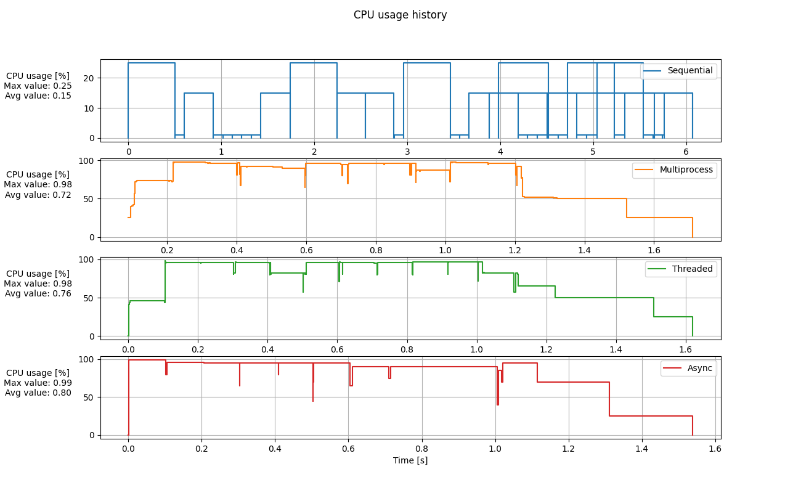
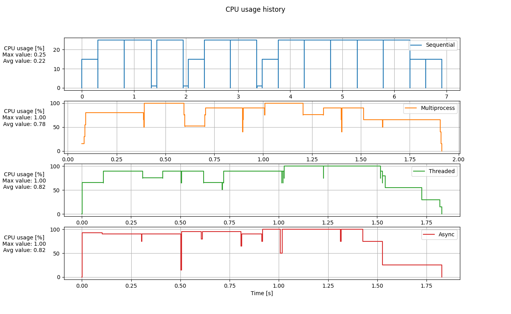

# ЛР #4: [ALGO]: Parallel/Asynch algorithms

Студент: Воропаев И. С.

Группа: Z4200

Преподаватель: Маслов И. Д.

Год: 2025

## Цель

Познакомиться с инструментами, направленными на решение задач, использующих технологии распараллеливания.

## Задание

Моделирование нагрузки пользователей, которые обращаются почти одновременно на сервер (запросы выстраиваются в очередь).

**Дано:**
- Действие 1: Регистрация на портале (время обработки T1, нагрузка на процессор ~25%)
- Действие 2: Получение главной страницы (время обработки T2, нагрузка на процессор ~15%)
- Действие 3: Просмотр перечня зарегистрированных пользователей (время обработки T3, нагрузка на процессор ~1%)

- U1 – количество пользователей, которые отправляют запрос на действие 1 
- U2 – количество пользователей, которые отправляют запрос на действие 2
- U3 – количество пользователей, которые отправляют запрос на действие 3

**Требуется:** 
Составить программу, на которой смоделировать поведение обработки запросов пользователей. Рассмотреть вариант последовательного решения задачи (1) и параллельных вариантах (рассмотреть каждый), subprocess (2), threads (3), asyncio (4).

## Реализация:

Обработка запроса представляет из себя ожидание `time.sleep(...)` с длительностью, которая задается в параметрах в зависимости от типа запроса (1 из 3). Ожидание блокирующее в случае обработчиков 1-3 и неблокирующее в случае обработчика 4 (см. ниже). 

**Обработчики запросов:**
1. `Последовательный` - просто в порядке живой очереди выполняет каждый запрос без приоритетов и распараллеливания.
2. `Мультипроцессовый` - запускает одновременно несколько процессов (количество процессов задается в параметрах моделирования) и обрабатывает запросы впараллель. Также, запрос может стоять в ожидании при имеющемся свободном процессе, если полностью заняты ресурсы CPU не полным набором процессов.
3. `Многопоточный` - запускает одновременно несколько потоков (количество потоков задается в параметрах моделирования) и обрабатывает запросы впараллель. Также, запрос может стоять в ожидании при имеющемся свободном потоке, если полностью заняты ресурсы CPU не полным набором потоков.
4. `Асинхронный` - запускает обработку каждого запроса, при этом доходя до неблокирующего ожидания (`await asyncio.sleep(...)`), переходит к другому запросу, пока имеются ресурсы. Если ресурсов нет, то процесс встает также в **асинхронное** ожидание.

Была написана программа симмулирующая поведения обработчика запросов от пользователей. Симуляция состоит из этапов:

1. Генерация запросов ([`UserRequest`](../src/user_request.py)) на одно из 3 действий.
2. Запуск измерения времени и одного из 4 типов обработчика.
3. В процессе обработки при принятии запроса в работу это действие фиксируется менеджером CPU ([`CpuManager`](../src/cpu_manager.py)). Который в случае, если на задачу нет ресурсов ставит ее в ожидание. Также CPU менеджер фиксирует конец обработки каждого запроса и освобождение ресурсов.
4. В конце симуляции выдается время суммарной обработки запросов и подробная статистика использования CPU - максимальная занятость, средняя занятость и график занятости CPU от времени.

Для запуска моделирования необходимо задать параметры в файле [`sim_params.py`](../src/sim_params.py). Затем запустить основной файл (активировав при этом окружение):

```
source .venv/bin/activate
python3 lab9/src/run_simulation.py
```
## Итог:

### Результаты моделирования:

Посмотрим результаты моделирования для 5 разных сценариев (описание параметров можно посмотреть в [`sim_params.py`](../src/sim_params.py)):

- Dem-1: `U1=U2=U3=1;  NUM_WORKERS = 4`
- Dem-2: `U1=3, U2=5, U3=10; NUM_WORKERS = 4`
- Dem-3: `U1=3, U2=5, U3=10; NUM_WORKERS = 8`
- Dem-4: `U1=6, U2=10, U3=20; NUM_WORKERS = 8`
- Dem-5: `U1=10, U2=5, U3=3; NUM_WORKERS = 4`

Суммарное время обработки всех запросов приведено в таблице:

|ID сценария | Последовательный, с | Мультипроцессовый, с | Многопоточный, с | Асинхронный, с |
|:-----------|:--------------------|:---------------------|:-----------------|:---------------|
| Dem-1      | 0.908               | 0.541                | 0.503            | 0.508          |
| Dem-2      | 4.083               | 1.503                | 1.221            | 1.030          |
| Dem-3      | 4.083               | 1.073                | 0.912            | 1.030          |
| Dem-4      | 5.745               | 1.690                | 1.621            | 1.539          |
| Dem-5      | 6.912               | 1.883                | 1.830            | 1.828          |


Среднее (на промежутке времени) использование CPU для за время обработки всех запросов приведено в следующей таблице:

|ID сценария | Последовательный, % | Мультипроцессовый, % | Многопоточный, % | Асинхронный, % |
|:-----------|:--------------------|:---------------------|:-----------------|:---------------|
| Dem-1      | 19.0                | 31.4                 | 34.2             | 34.2           |
| Dem-2      | 15.2                | 40.8                 | 50.5             | 59.9           |
| Dem-3      | 15.2                | 56.8                 | 67.4             | 59.9           |
| Dem-4      | 15.2                | 72.0                 | 75.9             | 80.0           |
| Dem-5      | 21.7                | 77.9                 | 82.0             | 81.6           |

Ниже приведены графики нагрузки на CPU при обработки запросов в зависимости от времени симуляции:

**Dem-1:**
<div align="center">
  
  <p>Dem-1 использование CPU</p>
</div>

**Dem-2:**

<div align="center">
  
  <p>Dem-2 использование CPU</p>
</div>

<div align="center">
  
  <p>Dem-3 использование CPU</p>
</div>

<div align="center">
  
  <p>Dem-4 использование CPU</p>
</div>

<div align="center">
  
  <p>Dem-5 использование CPU</p>
</div>

### Выводы:

- Была написана модель обработки запросов пользователей к серверу. С помощью этой модели было исследование время обработки и загрузка CPU для описанных выше 4 типов обработчиков запросов.
- Основная гипотеза, которая была проверена - то, что `асинхронное программирование в случае, когда для получения ответа на запрос необходимо ожидание позволяет добиться работы системы в режиме очень близком к параллельной обработке всех запросов`. Подтверждением этому могут служить графики использования CPU в зависимости от времени, где для мультипроцессорной, многопоточной и асинхронной обработки динамика использования ресурсов почти совпадает.
- Из таблиц времени работы видно, что при увеличении числа потоков можно все равно добиться более быстрого действия, чем при асинхронной обработке (Dem-2 и Dem-3). Однако, при пропорциональном увеличении трафика (Dem-4), асинхронная обработка снова станет выигрывать. Отсюда можно сделать вывод, что способность к масштабированию асинхронной системы выше, чем у системы, использующей распараллеливание (для таких систем необходимо задействовать больше физических ресурсов).
- Также из таблиц среднего использования CPU и времени обработки запроса видно, что уменьшение времени обработки запроса можно добиться увеличением загруженности CPU (или более оптимальном планированием загрузки CPU).
